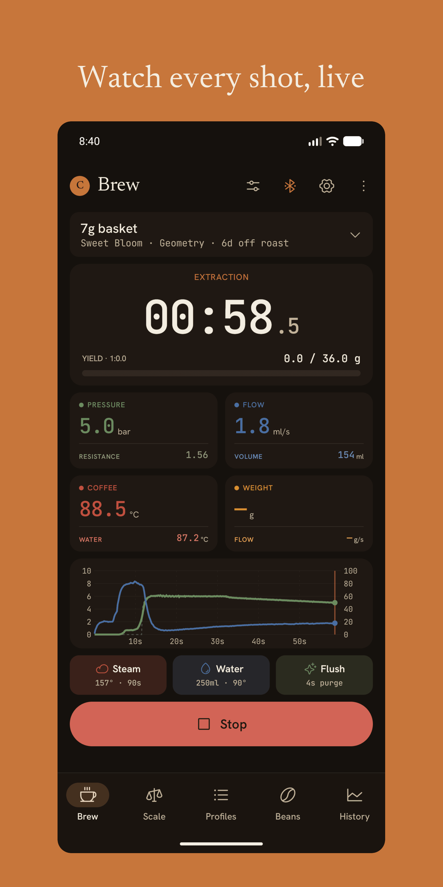
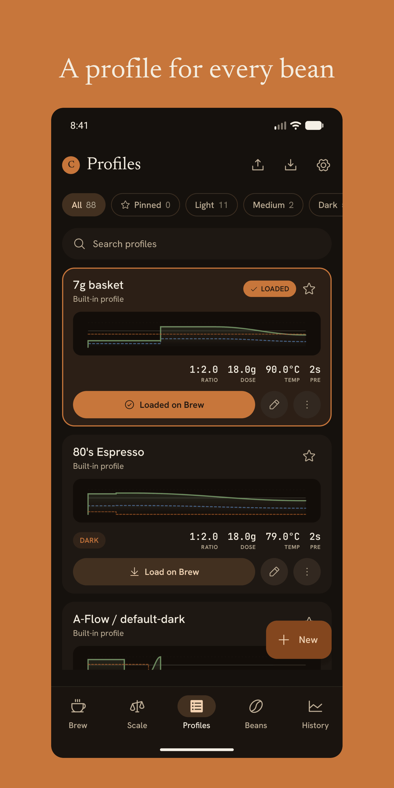
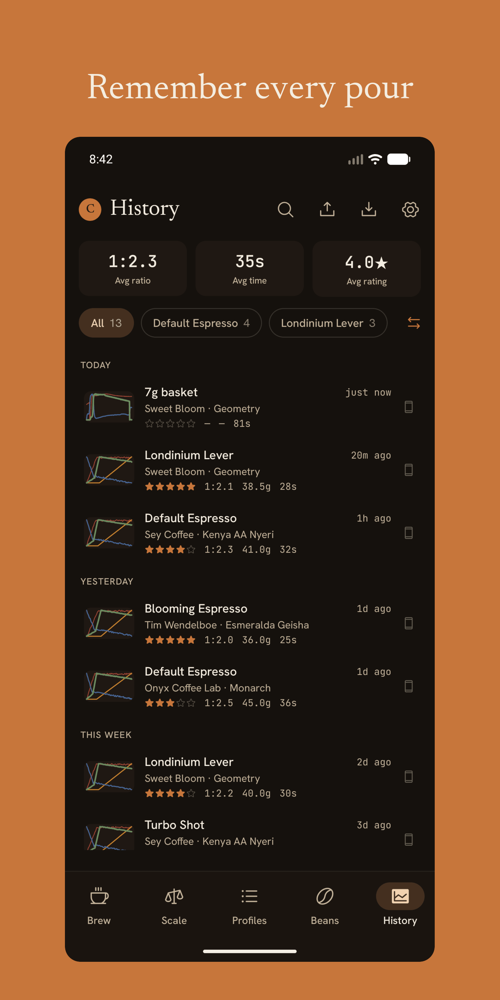
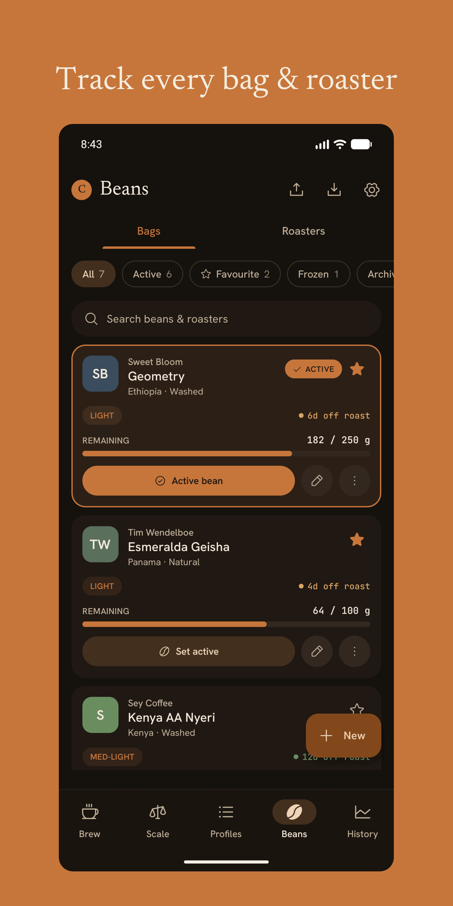

<div align="center">


# Crema

**A modern, open-source companion app for the [Decent Espresso DE1](https://decentespresso.com/).**

[](LICENSE)
[](https://www.rust-lang.org/)
[](https://kit.svelte.dev/)

</div>

---

> **Unofficial. Not affiliated with Decent Espresso.** Crema talks to the DE1 over its public Bluetooth GATT protocol. The official client is [`de1app`](https://github.com/decentespresso/de1app).

Crema is a clean-room reimplementation of the DE1 tablet experience as a **fast, type-safe, testable, browser-based PWA** with parallel native Android development. The codebase is split into a sans-IO Rust core that owns the protocol and a SvelteKit-based web shell that owns the UI and transport.

> **▶ Try the live web app: [crema.maceiras.dev](https://crema.maceiras.dev)** — it runs entirely in your browser, nothing to install. Pairing a DE1 or scale needs a **Chromium** browser (Chrome, Edge, Brave) for Web Bluetooth; add it to your home screen to install it as an offline PWA. Prefer a native app? See **[Install on Android](#install-on-android)** below.

## Screenshots

<div align="center">




<br/>
<sub><b>Android phone</b> — live brew dashboard · profile library · shot history · bean library</sub>
<br/><br/>
<sub><b>10&Prime; tablet:</b>
<a href="android/distribution/play-listing/en-US/images/tenInchScreenshots/01-brew-dashboard.png">Brew</a> ·
<a href="android/distribution/play-listing/en-US/images/tenInchScreenshots/02-profiles.png">Profiles</a> ·
<a href="android/distribution/play-listing/en-US/images/tenInchScreenshots/03-history.png">History</a> ·
<a href="android/distribution/play-listing/en-US/images/tenInchScreenshots/04-beans.png">Beans</a> ·
<a href="android/distribution/play-listing/en-US/images/tenInchScreenshots/05-settings.png">Settings</a>
</sub>
</div>

## Features

- **Live brew dashboard** — real-time pressure / flow / temperature / weight telemetry, four-channel chart, phase indicator, and shot-completion metrics.
- **Profile library** — pin favorites, edit frames, sync to/from [visualizer.coffee](https://visualizer.coffee), and live-preview each profile's intent.
- **Shot history** — record every pour locally with full telemetry, link shots to beans/roasters, multi-shot overlay comparison, and round-trip community v2 `.shot.json` import/export.
- **Bean + roaster library** — track bags, roast levels, grinder settings, and per-shot retroactive bean rebinding with snapshot semantics.
- **Bluetooth scales** — first-class support for Bookoo Themis, Decent Scale, Acaia (Lunar / Pyxis / Pearl), Skale, Eureka Precisa, Solo Barista, Hiroia Jimmy, Difluid, Felicita, Atomheart Eclair, Varia Aku, and Smartchef.
- **Visualizer integration** — OAuth 2.0 + PKCE auth, full two-way sync of shots, beans, and roasters with LWW conflict resolution.
- **Maintenance tracking** — water filter, descale, and cleaning cycle reminders with one-click "Run" buttons that drive the DE1's built-in cycles.
- **Replay capture** — record BLE traces of real sessions and replay them deterministically through the core for development and regression testing.

## Install on Android

<p align="center">
  <a href="https://f-droid.org/packages/dev.maceiras.crema/"></a>
  <a href="https://apt.izzysoft.de/fdroid/index/apk/dev.maceiras.crema"></a>
  <a href="https://apps.obtainium.imranr.dev/redirect?r=obtainium://add/https://github.com/geota/crema"></a>
  <a href="https://github.com/geota/crema/releases/latest"></a>
</p>

<sub>F-Droid + IzzyOnDroid are pending inclusion; Obtainium (recommended) and GitHub work today.</sub>

> The native Android app is in active development. Builds ship on two **trains** — pick whichever you want to follow.

**Stable** — tagged releases:

- **[IzzyOnDroid](https://apt.izzysoft.de/)** (an F-Droid-compatible repo): add `https://apt.izzysoft.de/fdroid/repo` to your F-Droid client, then search for **Crema**. *(Pending the IzzyOnDroid inclusion request.)*
- Or download the APK from the [latest release](https://github.com/geota/crema/releases/latest). See the **[changelog](CHANGELOG.md)** for what each release includes.

**Nightly** — the latest commit on `main`, rebuilt on every push:

- **[Obtainium](https://github.com/ImranR98/Obtainium)** (recommended — installs *and* auto-updates straight from GitHub):
  1. Install Obtainium itself, from its [GitHub releases](https://github.com/ImranR98/Obtainium/releases).
  2. Tap **Add App** and paste the source URL `https://github.com/geota/crema`.
  3. Turn on **Include prereleases** — the nightly build is published as a GitHub *prerelease*.
  4. Tap **Add**, then **Install**. Obtainium updates it in place whenever a new nightly ships.
- Or download the APK straight from the [`nightly`](https://github.com/geota/crema/releases/tag/nightly) prerelease and sideload it.

Stable and nightly are the **same app** (`dev.maceiras.crema`), signed with the same key and sharing one strictly-increasing version scheme: a nightly's version code sits just above the release it builds on and below the next one, so **every tagged release is an in-place upgrade over the nightlies that preceded it** — no manual reinstall. The **Include prereleases** switch just picks which lane you follow. Minimum Android 12 (API 31).

## Tech stack

| Layer | Technology |
|---|---|
| **Core** | Rust (sans-IO), compiled to WebAssembly via `wasm-bindgen`. Pure protocol codecs, shot state machine, profile model, and signature/reconciliation helpers. No I/O, no UI — fully testable without hardware. |
| **Web shell** | SvelteKit 2 + Svelte 5 (runes), TypeScript, adapter-static. Web Bluetooth API for DE1 + scale transports. PWA with offline install. |
| **Bindings** | `typeshare` generates the shared Rust types for both shells (TypeScript **and** Kotlin); `UniFFI` bridges the core to Android; `openapi-typescript` types the Visualizer API. |
| **Storage** | `localStorage` for shots / beans / profiles, `IndexedDB` for binary captures, vanilla content-negotiated JSON for export. |

## Quick start

### Prerequisites

- **Rust** 1.95+ (2024 edition) with `wasm-pack` (`cargo install wasm-pack`)
- **Node.js** 24 — an `.nvmrc` is committed, so `nvm use` / `fnm use` picks it up
- **[pnpm](https://pnpm.io/)** — the repo pins `pnpm@11` via `packageManager`; run `corepack enable` and the matching version is used automatically
- A browser with [Web Bluetooth](https://caniuse.com/web-bluetooth) support — Chrome / Edge / Opera. Brave works after enabling the flag (see below).

<details>
<summary><strong>Enabling Web Bluetooth in Brave</strong></summary>

Brave ships Web Bluetooth disabled by default. To turn it on:

1. Open `brave://flags/#brave-web-bluetooth-api` (paste the URL into the address bar).
2. Set the **Web Bluetooth API** flag to **Enabled**.
3. Click **Relaunch** at the bottom of the page.

After the restart, Brave will prompt for device-picker permissions like Chrome does. No other browser config is required.

</details>

### Run the dev server

```bash
git clone https://github.com/geota/crema.git
cd crema/web
pnpm install
pnpm wasm     # one-time wasm build of the Rust core
pnpm dev
```

Open `http://localhost:5173`. The web shell starts in a connected-to-nothing state — click "Connect" to pair your DE1 over Web Bluetooth.

> **Pairing tip — DE1 may advertise as `nRF5x` in the browser's Web Bluetooth picker.**

### Visualizer integration (optional)

To enable Visualizer OAuth sync, register a public Doorkeeper application at <https://visualizer.coffee/oauth/applications>, then drop the Client UID into a local env file:

```bash
cp web/.env.example web/.env.local
# Edit web/.env.local — paste your VITE_VISUALIZER_CLIENT_ID
```

### Build for production

```bash
pnpm build         # static site → web/build/
```

### Run the test suite

```bash
# Rust core
cd core
cargo test --workspace

# Web shell type-check + unit tests
cd web
pnpm check       # svelte-check (type-check)
pnpm test        # vitest unit tests
```

### Git hooks

A pre-push hook that mirrors CI (fmt, clippy, tests, svelte-check, build) lives in `.githooks/`. `pnpm install` wires it up automatically (via the `prepare` script) — usually there's nothing to do. To (re)install it by hand:

```bash
scripts/install-hooks.sh   # or: git config core.hooksPath .githooks
```

Bypass for a one-off push with `SKIP_CI_CHECKS=1 git push` — CI will still run on the remote.

## Project layout

```
crema/
├── core/                     # Rust workspace (sans-IO, edition 2024)
│   ├── de1-protocol/         #   DE1 BLE wire codec
│   ├── de1-scale/            #   Per-scale BLE codecs (13 models)
│   ├── de1-domain/           #   Shot model, profiles, beans, sync/reconciliation
│   ├── de1-app/              #   Orchestrator — the `CremaCore` facade + event stream
│   ├── de1-wasm/             #   wasm-bindgen bridge for the web shell
│   ├── de1-ffi/              #   UniFFI bridge for the Android shell
│   └── bindings/             #   Generated shared types (typeshare → .ts + .kt)
├── web/                      # SvelteKit PWA
│   ├── src/lib/              #   Core wrapper, stores, components, BLE transports, Effect services
│   ├── src/routes/           #   / (brew), /profiles, /beans, /history, /scale, /settings
│   └── static/               #   Icons, manifest, PWA assets
├── android/                  # Native Jetpack Compose shell (phone + tablet)
│   └── app/src/main/java/coffee/crema/   #   ble/ · ui/ (screens) · core/ (UniFFI) · diag/
├── .githooks/                # Pre-push hook mirroring CI
└── .github/workflows/        # ci · nightly · release pipelines
```

## Native Android tablet + phone apps

A parallel **Jetpack Compose** shell for Android — with dedicated tablet and phone layouts — is available alongside the web app ([install it above](#install-on-android)). It reuses the same Rust `de1-core` workspace via [UniFFI](https://github.com/mozilla/uniffi-rs) bindings — the protocol codecs, shot state machine, profile model, bean/roaster store, and Visualizer reconciliation logic all share **one source of truth across web and Android**.

Why both shells:

- **Tablet-first ergonomics** — the DE1 is paired with a tablet 90% of the time. A native Compose UI gets edge-to-edge layouts, Material 3 motion, and predictable BLE behavior the way Android users expect.
- **Phone companion** — a slimmer "remote" surface for one-handed brewing-context switches (start/stop, weight readout, last-shot review) without breaking eye contact with the espresso.
- **Background BLE** — native Android can keep the DE1 + scale connections alive when the screen is off and across Doze, something the web shell can't guarantee.
- **Same brain, two faces** — bug-fix the protocol once in Rust, both shells inherit. Add a bean field once in the domain crate, both UIs see it via typeshare / UniFFI.

The Rust core's surface (`CremaCore` facade + typed event stream) is already FFI-ready; the Android shell tracks parity feature-by-feature against the web shell.

## Contributing

Issues and pull requests welcome. The codebase aims for:

- **Type-driven design** — make illegal states unrepresentable.
- **Sans-IO core** — protocol + domain logic tested without hardware.
- **Behavioral fidelity** — bytes, timing, and state transitions match the DE1's firmware spec exactly; structure is free to evolve.
- **Tight, idiomatic code** — no speculative abstractions; YAGNI is a best practice.

Before opening a PR:

```bash
cd core && cargo test --workspace && cargo clippy --workspace --all-targets -- -D warnings
cd ../web && pnpm check && pnpm build
```

## Acknowledgements

- **[Decent Espresso](https://decentespresso.com/)** for the DE1 hardware and the open Bluetooth protocol.
- **[`de1app`](https://github.com/decentespresso/de1app)** — the canonical Tcl reference implementation. Crema's protocol fidelity is verified against legacy `de1app` and the newer [`reaprime`](https://github.com/reaprime) Dart client.
- **[Visualizer](https://visualizer.coffee/)** for the shot-sharing service and its public API.
- **The Decent community** — Diaspora forum, Discord, and r/decentespresso — for collective wisdom on shot dynamics, profile design, and the protocol's many undocumented quirks.

## Built with AI assistance

Crema was built with heavy use of **large-language-model (LLM)-assisted development** — including Anthropic's [Claude](https://www.anthropic.com/claude) (via [Claude Code](https://www.claude.com/claude-code)) for a substantial portion of its code, design, and documentation. The project is reviewed and tested, but AI-assisted software can carry subtle or non-obvious defects — please mind the [no-warranty, use-at-your-own-risk Terms](https://crema.maceiras.dev/terms) (especially around machine control), and report anything that looks off via a [GitHub issue](https://github.com/geota/crema/issues).

## License

Crema is licensed under the **GNU General Public License v3.0 or later** — see [`LICENSE`](LICENSE). This matches the DE1 ecosystem (`de1app` is GPL-3.0), so GPL-licensed code may be referenced and adapted freely.

Copyright © 2026 Adrian Maceiras.
