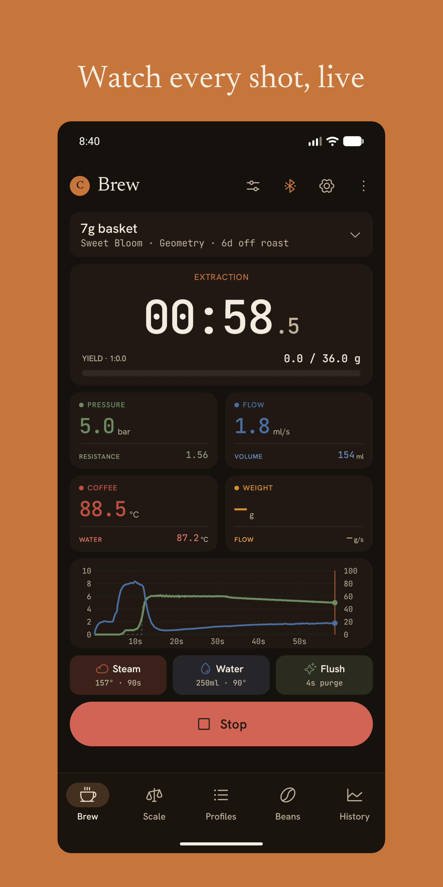
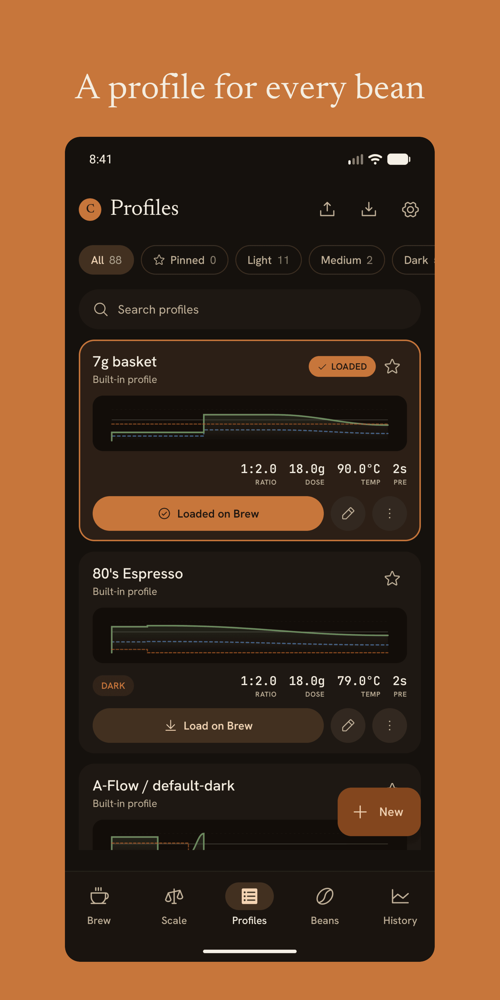
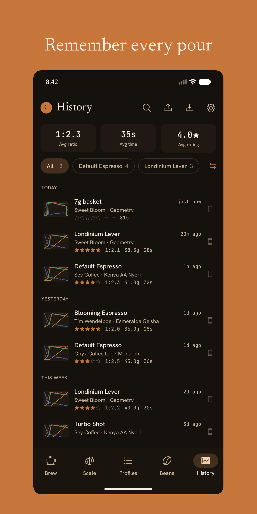
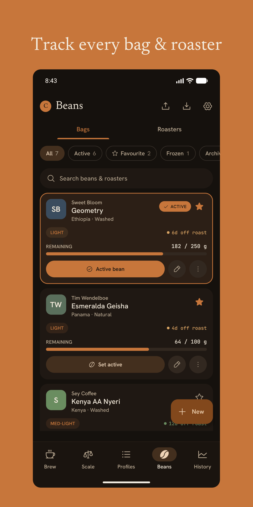

<div align="center">


# Crema

**A modern, open-source companion app for the [Decent Espresso DE1](https://decentespresso.com/).**

[](LICENSE)
[](https://www.rust-lang.org/)
[](https://kit.svelte.dev/)
[](android/)

</div>

---

> **Unofficial. Not affiliated with Decent Espresso.** Crema talks to the DE1 over its public Bluetooth GATT protocol. The official client is [`de1app`](https://github.com/decentespresso/de1app).

Crema is an independent, open-source DE1 companion: a **fast, type-safe, browser-based PWA** and a **native Android app** (tablet and phone), both built on one sans-IO Rust core that owns the protocol and domain logic. The shells own the UI and the Bluetooth transport.

Crema is not a clean-room implementation. It draws liberally on existing open-source DE1 software as references for protocol behaviour and features: [`de1app`](https://github.com/decentespresso/de1app) (the official Tcl app), [`decaid`](https://github.com/decentespresso/decaid) (Decent's Dart app, formerly reaprime), [Decenza](https://github.com/Kulitorum/Decenza), [Beanconqueror](https://github.com/graphefruit/Beanconqueror) and [Visualizer](https://visualizer.coffee/). GPL-licensed code from these projects is referenced and adapted under Crema's own GPL license (see [License](#license)), and the source comments cite the upstream file behind each port.

> **▶ Try the live web app: [crema.maceiras.dev](https://crema.maceiras.dev)**. It runs entirely in your browser, nothing to install. Pairing a DE1 or scale needs a **Chromium** browser (Chrome, Edge, Brave) for Web Bluetooth; add it to your home screen to install it as an offline PWA. Prefer a native app? See **[Install on Android](#install-on-android)** below.

## Screenshots

<div align="center">




<br/>
<sub><b>Android phone</b> — live brew dashboard · profile library · shot history · bean library</sub>
<br/><br/>
<sub><b>10&Prime; tablet:</b>
<a href="android/distribution/play-listing/en-US/images/tenInchScreenshots/01-brew-dashboard.png">Brew</a> ·
<a href="android/distribution/play-listing/en-US/images/tenInchScreenshots/02-profiles.png">Profiles</a> ·
<a href="android/distribution/play-listing/en-US/images/tenInchScreenshots/03-history.png">History</a> ·
<a href="android/distribution/play-listing/en-US/images/tenInchScreenshots/04-beans.png">Beans</a> ·
<a href="android/distribution/play-listing/en-US/images/tenInchScreenshots/05-settings.png">Settings</a>
</sub>
</div>

## Features

Everything below ships in the web app and the Android app (tablet and phone) unless marked otherwise.

**Espresso**

- **Live brew dashboard**: real-time pressure, flow, temperature, weight and puck resistance against the profile's goal curves, a step-by-step phase list, stop conditions and shot-completion metrics.
- **Stop-at-weight that learns**: predictive stop-at-weight plus stop-at-volume; Crema learns how much drips in after the stop for each profile and scale pair (a port of Decenza's model) and stops early by that amount.
- **Profile library**: the 89 built-in de1app profiles (including Adaptive v3), pinning, a multi-step editor with a live curve preview, `.json` / `.tcl` import and community v2 JSON export.
- **Shot quality**: each shot in History gets a verdict with channeling, grind-direction and early-stop hints (ported from Decenza's shot analysis).
- **Quick Controls**: steam, hot water and flush with configurable targets.

**Brew Log (filter and more)**

- **Log any brew**: V60, Chemex, Kalita Wave, AeroPress, French press, Clever, siphon, moka, cold brew, drip, manual espresso, or your own **custom methods**. Each brew deducts its dose from the bag and sits in History next to your shots.
- **Guided brews**: the Scale page's Brew mode runs a recipe step by step (bloom, pours, waits, drawdown) with a big clock, live weight against each target when a scale is connected, and cues.
- **Credited built-in recipes**: 13 published recipes, each linked to its source: James Hoffmann, Tetsu Kasuya's 4:6, the official AeroPress recipe, Tuomas Merikanto, Stumptown and Hario. Duplicate one to make it your own.
- **Planned vs poured**: a guided brew's chart draws the recipe's planned staircase under the weight you actually poured, live and in History.

**Beans and history**

- **Shot history**: full telemetry for every shot, filters by profile, method and bean, multi-shot overlay comparison, and community v2 `.shot.json` import/export.
- **Bean and roaster library**: bags, roast and open dates, freshness, grams remaining, photos, and a roaster's shelf of bags. Retroactively rebind a shot to a bag (the shot keeps a snapshot).
- **Roaster duplicate merge**: Crema spots roasters with the same name and offers to merge them. The bags move to one roaster, and the duplicate is tagged rather than deleted, so you can un-merge it later.
- **Beanconqueror import and export**: import beans, roasters and brews from a Beanconqueror export; export the bean library as a Beanconqueror ZIP.
- **Visualizer catalogue search** in the bean form: pick a coffee and Crema fills the empty fields.

**Machine and scales**

- **DE1 over Bluetooth**: connect, control and stream telemetry. Every machine setting Crema owns (fan, refill point, steam, hot water, flush, heater tweaks) is re-applied on connect.
- **Bluetooth scales**: Bookoo Themis, Decent Scale and Half Decent Scale, Acaia (Lunar, Pyxis, Pearl and older models), Skale II, Felicita Arc, Eureka Precisa, Solo Barista, Timemore Dot, Hiroia Jimmy, DiFluid Microbalance (and Ti), Atomheart Eclair, Varia Aku and Smartchef. A Half Decent Scale on firmware 3+ soft-sleeps with the DE1 instead of disconnecting.
- **Maintenance**: water filter, descale and clean reminders, tank level with a low-water warning, and buttons that run the DE1's descale, clean and air-purge cycles, including on a cold machine with firmware older than build 1356.
- **Tablet charging control** for a tablet powered from the DE1's USB port: Always on (default), Smart (55 to 65 %) or High (90 to 95 %).
- **Stolen-machine notice**: if the connected DE1's serial is on Decent's stolen or lost list, Settings shows a one-line notice.

**Sync and backup** (all opt-in; Crema is local-first and has no account of its own)

- **Visualizer**: OAuth 2.0 + PKCE sign-in. Shots upload, pull and sync edits, and beans and roasters sync both ways with last-write-wins conflict resolution, on both shells. Coffee-bag and roaster writes need a Visualizer Premium account, and on free accounts Crema skips Premium-only shot fields.
- **Decent account**: upload every shot to your decentespresso.com shot history in the same format the tablet app and decaid use, get a share link, and have edits re-uploaded.
- **Backups**: a `.crema.zip` with profiles, beans (with photos), shots and settings that restores on either shell, plus optional Google Drive backup.
- **Webhooks** (web): outgoing POSTs when a shot finishes, the DE1 or a scale connects, a profile is uploaded, or the machine reports an error.
- **Capture and replay**: record BLE sessions and replay them through the core, in the web app (Settings → Advanced) or in tests.

## Install on Android

<p align="center">
  <a href="https://apps.obtainium.imranr.dev/redirect?r=obtainium://add/https://github.com/geota/crema"></a>
  <a href="https://github.com/geota/crema/releases/latest"></a>
  <!--
    Not listed yet (both package pages return 404 as of 2026-10-02). To re-enable, move these
    badges above this comment once dev.maceiras.crema is live there, and restore the
    IzzyOnDroid bullet under "Stable":
  <a href="https://f-droid.org/packages/dev.maceiras.crema/"></a>
  <a href="https://apt.izzysoft.de/fdroid/index/apk/dev.maceiras.crema"></a>
  -->
</p>

<sub>F-Droid, IzzyOnDroid and Google Play: planned, not listed yet.</sub>

> The Android app is in active development. Builds ship on two **trains**; pick whichever you want to follow.

**Stable**: tagged releases.

- Download the APK from the [latest release](https://github.com/geota/crema/releases/latest). See the **[changelog](CHANGELOG.md)** for what each release includes.
- Or add `https://github.com/geota/crema` to **Obtainium** (steps below) with **Include prereleases** off.

<!--
- **[IzzyOnDroid](https://apt.izzysoft.de/)** (an F-Droid-compatible repo): add `https://apt.izzysoft.de/fdroid/repo` to your F-Droid client, then search for **Crema**.
-->

**Nightly**: the latest commit on `main`, rebuilt on every push.

- **[Obtainium](https://github.com/ImranR98/Obtainium)** (recommended; installs *and* auto-updates straight from GitHub):
  1. Install Obtainium itself, from its [GitHub releases](https://github.com/ImranR98/Obtainium/releases).
  2. Tap **Add App** and paste the source URL `https://github.com/geota/crema`.
  3. Turn on **Include prereleases**: the nightly build is published as a GitHub *prerelease*.
  4. Tap **Add**, then **Install**. Obtainium updates it in place whenever a new nightly ships.
- Or download the APK straight from the [`nightly`](https://github.com/geota/crema/releases/tag/nightly) prerelease and sideload it.

Stable and nightly are the **same app** (`dev.maceiras.crema`), signed with the same key and sharing one strictly increasing version scheme: a nightly's version code sits just above the release it builds on and below the next one, so **every tagged release is an in-place upgrade over the nightlies that preceded it**, with no manual reinstall. The **Include prereleases** switch just picks which lane you follow. Minimum Android 12 (API 31).

## Tech stack

| Layer | Technology |
|---|---|
| **Core** | Rust (sans-IO, edition 2024), compiled to WebAssembly via `wasm-bindgen` and to Android via UniFFI. Protocol codecs, scale codecs, the shot state machine, stop-at-weight, profiles, beans, history, backups and Visualizer / Decent wire formats. No I/O, no UI; fully testable without hardware. |
| **Web shell** | SvelteKit 2 + Svelte 5 (runes), TypeScript, adapter-static, Effect for services, uPlot charts. Web Bluetooth for the DE1 and scales. PWA with offline install, hosted on Cloudflare Pages. |
| **Android shell** | Kotlin + Jetpack Compose (Material 3), separate tablet and phone layouts, Nordic BLE, Ktor. |
| **Bindings** | `typeshare` generates the shared Rust types for both shells (TypeScript **and** Kotlin); `UniFFI` bridges the core to Android; `openapi-typescript` types the Visualizer API. |
| **Web storage** | `localStorage` for settings, profiles, beans and shot summaries; IndexedDB for shot telemetry, bean photos and BLE captures. Stored credentials are encrypted at rest. |

## Quick start

### Prerequisites

- **Rust** 1.95+ (`rust-version` in `core/Cargo.toml`; CI pins 1.95.0) with the `wasm32-unknown-unknown` target and `wasm-pack` (`cargo install wasm-pack`)
- **Node.js** 24 (what CI uses)
- **[pnpm](https://pnpm.io/)** 11: the repo pins `pnpm@11.5.0` via `packageManager`; run `corepack enable` and the matching version is used automatically
- A browser with [Web Bluetooth](https://caniuse.com/web-bluetooth) support: Chrome / Edge / Opera. Brave works after enabling the flag (see below).

<details>
<summary><strong>Enabling Web Bluetooth in Brave</strong></summary>

Brave ships Web Bluetooth disabled by default. To turn it on:

1. Open `brave://flags/#brave-web-bluetooth-api` (paste the URL into the address bar).
2. Set the **Web Bluetooth API** flag to **Enabled**.
3. Click **Relaunch** at the bottom of the page.

After the restart, Brave will prompt for device-picker permissions like Chrome does. No other browser config is required.

</details>

### Run the dev server

```bash
git clone https://github.com/geota/crema.git
cd crema/web
pnpm install
pnpm wasm     # wasm build of the Rust core (re-run after core changes)
pnpm dev
```

Open `http://localhost:5173`. The web shell starts in a connected-to-nothing state; click "Connect" to pair your DE1 over Web Bluetooth. No machine handy? Settings → Advanced → **Replay a capture** plays a recorded session (e.g. `core/de1-app/tests/fixtures/*.jsonl`) through the dashboard.

> **Pairing tip: the DE1 may advertise as `nRF5x` in the browser's Web Bluetooth picker.**

### Visualizer and Google Drive (optional)

To enable Visualizer OAuth sync, register a public Doorkeeper application at <https://visualizer.coffee/oauth/applications>, then put the Client UID into a local env file. Google Drive backup takes an OAuth client ID the same way.

```bash
cp web/.env.example web/.env.local
# Edit web/.env.local: VITE_VISUALIZER_CLIENT_ID, VITE_GOOGLE_DRIVE_CLIENT_ID
```

### Build for production

```bash
pnpm build         # wasm + static site → web/build/
```

### Android

Build instructions, the architecture notes and the UniFFI / `cargo-ndk` toolchain live in [`android/README.md`](android/README.md).

### Run the test suite

```bash
# Rust core
cd core
cargo test --workspace

# Web shell type-check + unit tests
cd web
pnpm check       # svelte-check (type-check)
pnpm test        # vitest unit tests
```

### Git hooks

A pre-push hook in `.githooks/` mirrors the CI `rust` and `web` jobs: `cargo fmt --check`, `cargo clippy -D warnings`, `cargo test`, the built-in profile id check, then `pnpm install --frozen-lockfile`, `pnpm wasm`, `pnpm check` and `pnpm build`. `pnpm install` wires it up automatically (via the `prepare` script), so usually there's nothing to do. To (re)install it by hand:

```bash
scripts/install-hooks.sh   # or: git config core.hooksPath .githooks
```

Bypass for a one-off push with `SKIP_CI_CHECKS=1 git push` (or skip one half with `SKIP_RUST=1` / `SKIP_WEB=1`); CI still runs on the remote.

### CI

- **`ci.yml`** (push / PR to `main`): Rust fmt, clippy, tests, built-in id and typeshare-bindings freshness; web `pnpm check` + build; an advisory `cargo audit` / `pnpm audit` (prod and all deps, high+), which also runs weekly on its own.
- **`security-lockfile.yml`** (daily): patches advisories in transitive web dependencies, which Dependabot's security updates can't do with pnpm 11. `scripts/fix-transitive-advisories.mjs` moves only the vulnerable packages in `web/pnpm-lock.yaml` (a commented override in `web/pnpm-workspace.yaml` only when a parent pins one), skips patched versions younger than pnpm's release-age policy, and keeps one rolling PR from `security/transitive-fixes`. For CI to run on that PR, add a fine-grained PAT (this repo; Contents and Pull requests: read/write) as the `SECURITY_PR_TOKEN` secret; otherwise close and reopen the PR. Run it locally with `cd web && node ../scripts/fix-transitive-advisories.mjs`.
- **`nightly.yml`** (push to `main`): builds the APK and republishes the rolling `nightly` prerelease.
- **`release.yml`** (`v*.*.*` tag): builds the APK and the PWA bundle, publishes the GitHub Release and deploys the web app to Cloudflare Pages. `scripts/cut-release.sh` writes the release notes and tags.
- **`pr-title.yml`**: checks the PR title prefix.

## Project layout

```
crema/
├── core/                     # Rust workspace (sans-IO, edition 2024)
│   ├── de1-protocol/         #   DE1 BLE wire codec (state, shot samples, MMR, profiles, firmware)
│   ├── de1-scale/            #   Per-scale BLE codecs (13 scale families)
│   ├── de1-domain/           #   Shots, profiles, beans, brew recipes, stop-at-weight, sync, import/export
│   ├── de1-app/              #   Orchestrator: the `CremaCore` facade + event stream, capture/replay
│   ├── de1-wasm/             #   wasm-bindgen bridge for the web shell
│   ├── de1-ffi/              #   UniFFI bridge for the Android shell
│   └── bindings/             #   Generated shared types (typeshare → .ts + .kt)
├── web/                      # SvelteKit PWA
│   ├── src/lib/              #   Core wrapper, stores, components, BLE transports, Effect services
│   ├── src/routes/           #   / (brew), /profiles, /beans, /history, /scale (weigh + guided brew),
│   │                         #   /settings, /auth (Visualizer callback), /privacy, /terms
│   └── static/               #   Icons, manifest, PWA assets
├── android/                  # Native Jetpack Compose app (tablet + phone)
│   ├── app/src/main/java/coffee/crema/
│   │                         #   ble/ (+ proxy/ LAN relay) · core/ (UniFFI) · ui/ (screens, phone/, brewlog/)
│   │                         #   beans · brew · history · profiles · maintenance · settings
│   │                         #   visualizer · decent · drive · security · update · diag
│   └── distribution/         #   Play listing images + release notes
├── fastlane/metadata/        # F-Droid / IzzyOnDroid store metadata
├── brand/                    # Logo sources
├── scripts/                  # cut-release.sh, install-hooks.sh
├── .githooks/                # Pre-push hook mirroring CI
└── .github/                  # workflows/ (ci · nightly · release · pr-title), screenshots/ (README)
```

## Native Android app

The Android app is a full native client of the same core, not a remote. It uses Jetpack Compose with separate tablet and phone layouts (the phone has its own navigation and screens for Brew, Profiles, Beans, History, Scale and Settings) and calls the Rust core through [UniFFI](https://github.com/mozilla/uniffi-rs). The protocol codecs, shot state machine, stop logic, profile model, bean and history stores, backups, and the Visualizer and Decent wire formats are **one source of truth across web and Android**: a protocol fix lands once in Rust and both shells inherit it.

Most features ship to web, tablet and phone together; the [changelog](CHANGELOG.md) says which shells each change reaches. Where they differ today:

- **Android only**: a background connection that keeps the DE1 link and reconnect loop alive with the screen off (opt-in, and only while the device is charging); multi-device mirroring, where one device owns the Bluetooth link and relays it to others on the LAN; and an on-demand update check against GitHub releases.
- **Web only**: webhooks.

## Contributing

Issues and pull requests welcome. The codebase aims for:

- **Type-driven design**: make illegal states unrepresentable.
- **Sans-IO core**: protocol and domain logic tested without hardware.
- **Behavioral fidelity**: bytes, timing and state transitions match the DE1's firmware and the reference apps; structure is free to evolve.
- **Tight, idiomatic code**: no speculative abstractions; YAGNI is a best practice.

Before opening a PR:

```bash
cd core && cargo test --workspace && cargo clippy --workspace --all-targets -- -D warnings
cd ../web && pnpm check && pnpm test && pnpm build
```

## Acknowledgements

- **[Decent Espresso](https://decentespresso.com/)** for the DE1 hardware and the open Bluetooth protocol.
- **[`de1app`](https://github.com/decentespresso/de1app)**, the official Tcl app and canonical reference for protocol behaviour, the built-in profiles and maintenance flows.
- **[`decaid`](https://github.com/decentespresso/decaid)** (formerly [reaprime](https://github.com/tadelv/reaprime)), Decent's Dart app: protocol cross-checks, the Decent shot-upload format and scale handling such as the Half Decent Scale's soft sleep.
- **[Decenza](https://github.com/Kulitorum/Decenza)**: the stop-at-weight learning model, shot-quality analysis, cold-machine maintenance and smart tablet charging are ported from it.
- **[Beanconqueror](https://github.com/graphefruit/Beanconqueror)** for its export format, which Crema imports and writes.
- **[Visualizer](https://visualizer.coffee/)** ([source](https://github.com/miharekar/visualizer)) for the shot-sharing service, its public API and the coffee catalogue.
- **[openscale](https://github.com/decentespresso/openscale)**, the Decent Scale firmware, for the scale's wire details.
- The recipe authors credited in the app (James Hoffmann, Tetsu Kasuya, AeroPress, Tuomas Merikanto, Stumptown, Hario).
- **The Decent community** (Diaspora forum, Discord and r/decentespresso) for collective wisdom on shot dynamics, profile design and the protocol's many undocumented quirks.

## Built with AI assistance

Crema was built with heavy use of **large-language-model (LLM)-assisted development**, including Anthropic's [Claude](https://www.anthropic.com/claude) (via [Claude Code](https://www.claude.com/claude-code)) for a substantial portion of its code, design and documentation. The project is reviewed and tested, but AI-assisted software can carry subtle or non-obvious defects. Please mind the [no-warranty, use-at-your-own-risk Terms](https://crema.maceiras.dev/terms) (especially around machine control), and report anything that looks off via a [GitHub issue](https://github.com/geota/crema/issues).

## License

Crema is licensed under the **GNU General Public License v3.0 or later**; see [`LICENSE`](LICENSE). This matches the DE1 ecosystem (`de1app`, `decaid`, Decenza and Beanconqueror are GPL-3.0), so GPL-licensed code from those projects is referenced and adapted here. Bundled third-party assets are listed in [`THIRD-PARTY-NOTICES.md`](THIRD-PARTY-NOTICES.md).

Copyright © 2026 Adrian Maceiras.
